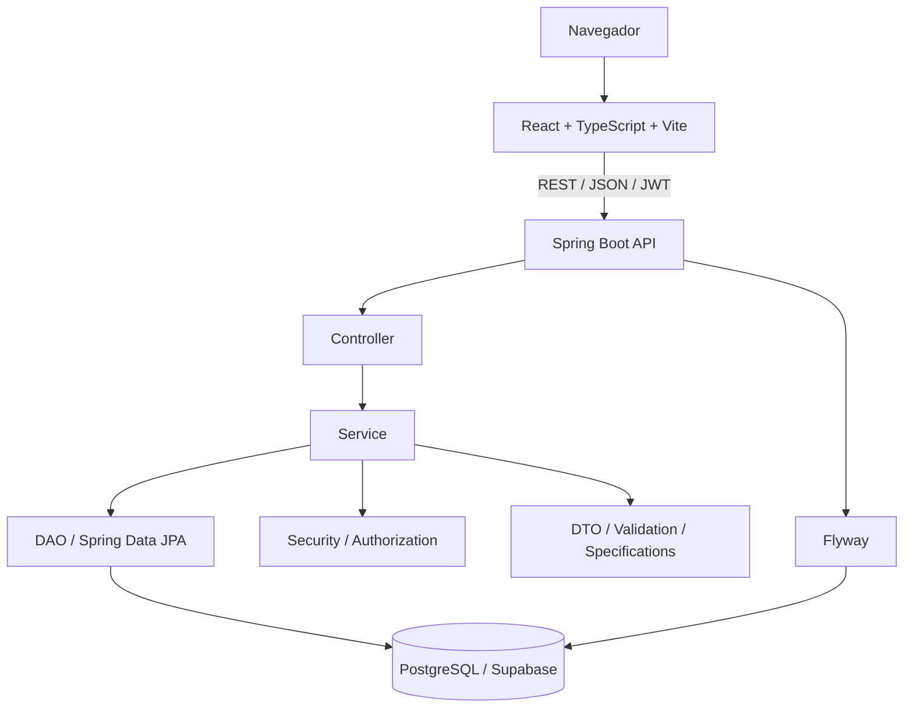

<div align="center">

# 📈 LeadFlow

### CRM B2B para gestão de Leads, tarefas, interações, equipes e desempenho comercial


Projeto full stack desenvolvido para centralizar o processo comercial de uma empresa, desde o cadastro e acompanhamento de Leads até tarefas, interações, pontuação, rankings e indicadores de desempenho.

**Frontend:** React + TypeScript + Vite  
**Backend:** Java 21 + Spring Boot  
**Banco:** PostgreSQL / Supabase

</div>

---

## 📚 Sumário

- [Sobre o projeto](#-sobre-o-projeto)
- [Principais funcionalidades](#-principais-funcionalidades)
- [Perfis de acesso](#-perfis-de-acesso)
- [Arquitetura](#-arquitetura)
- [Tecnologias](#-tecnologias)
- [Estrutura do repositório](#-estrutura-do-repositório)
- [Pré-requisitos](#-pré-requisitos)
- [Instalação rápida](#-instalação-rápida)
- [Configuração do banco e variáveis de ambiente](#-configuração-do-banco-e-variáveis-de-ambiente)
- [Executando o backend](#-executando-o-backend)
- [Executando no Eclipse](#-executando-no-eclipse)
- [Executando o frontend](#-executando-o-frontend)
- [Migrations com Flyway](#-migrations-com-flyway)
- [API e Swagger](#-api-e-swagger)
- [Testes e build](#-testes-e-build)
- [Problemas comuns](#-problemas-comuns)
- [Segurança](#-segurança)
- [Fluxo básico com Git](#-fluxo-básico-com-git)
- [Contexto acadêmico](#-contexto-acadêmico)

---

## 🎯 Sobre o projeto

O **LeadFlow** é um CRM B2B responsivo voltado para organização e acompanhamento do fluxo comercial. A aplicação permite registrar Leads, acompanhar o estágio de cada oportunidade, organizar tarefas, registrar interações, aplicar regras de pontuação e acompanhar indicadores de desempenho.

O sistema foi estruturado com separação clara de responsabilidades entre frontend, backend e banco de dados. No backend, as regras de autorização são aplicadas na própria API, evitando que o controle de acesso dependa apenas da interface.

> O projeto atual é executado localmente **sem Docker**.

---

## ✨ Principais funcionalidades

| Área | Recursos |
|---|---|
| **Autenticação** | Login, sessão JWT, refresh token, ativação de conta e logout |
| **Recuperação de senha** | Código temporário por e-mail ou console, validação e redefinição de senha |
| **Leads** | Cadastro, edição, filtros, responsável, estágio e histórico |
| **Interações** | Registro de contatos e aplicação de pontuação |
| **Tarefas** | Criação, edição, conclusão, cancelamento, filtros, lista e calendário |
| **Dashboard** | KPIs, evolução comercial e distribuição por estágio |
| **Períodos** | Indicadores e gráficos ajustados ao período selecionado |
| **Filiais** | Gestão e indicadores por filial |
| **Equipe** | Gestão de usuários e permissões por perfil |
| **Ranking** | Comparação de desempenho de filiais e usuários |
| **Pontuação** | Regras configuráveis para interações comerciais |
| **Configurações** | Dados da empresa, conta e preferências permitidas por perfil |

### Agrupamento dos gráficos

O intervalo visual dos gráficos muda conforme o período escolhido:

| Período selecionado | Agrupamento |
|---:|---|
| 7 dias | Diário |
| 30 dias | Semanal |
| 90 dias | Quinzenal |
| 180 dias | Mensal |
| 365 dias | Bimestral |

---

## 👥 Perfis de acesso

### Administrador

Possui visão ampla da empresa e acesso às funcionalidades administrativas, como filiais, equipe, regras de pontuação, configurações, Leads, tarefas, interações e indicadores.

### Gerente

Opera dentro do escopo de filiais e equipe permitido para sua conta, com acesso às informações gerenciais correspondentes.

### Vendedor

Trabalha com os próprios Leads, interações e tarefas. Endpoints administrativos não fazem parte do fluxo desse perfil.

> As permissões são validadas no **backend**. O frontend apenas reflete visualmente os recursos permitidos para cada usuário.

---

## 🏗️ Arquitetura



### Organização do backend

```text
Controller      → contrato HTTP e endpoints REST
Service         → regras de negócio, autorização e transações
DAO             → persistência com Spring Data JPA
Model           → entidades JPA
DTO             → objetos de entrada e saída
Security        → autenticação, JWT e filtros
Specification   → filtros e consultas dinâmicas
Validation      → validações de domínio
Utils           → utilitários reutilizáveis
```

---

## 🧰 Tecnologias

### Backend

- Java 21
- Spring Boot 4.1
- Spring Web MVC
- Spring Data JPA
- Spring Security
- Bean Validation
- Spring Mail
- PostgreSQL
- Flyway
- JWT HMAC-SHA256
- BCrypt
- SpringDoc OpenAPI / Swagger
- Maven
- JUnit 5

### Frontend

- React 19
- TypeScript 5.8
- React Router
- Vite
- CSS responsivo
- API REST
- Access token + refresh token

### Infraestrutura de dados

- PostgreSQL
- Supabase como serviço de banco PostgreSQL
- Flyway para controle de schema

---

## 📁 Estrutura do repositório

```text
LeadFlow---Projeto-1/
├── backend/
│   ├── src/main/java/br/com/leadflow/
│   │   ├── config/
│   │   ├── controller/
│   │   ├── dao/
│   │   ├── dto/
│   │   ├── exception/
│   │   ├── model/
│   │   ├── security/
│   │   ├── service/
│   │   ├── specification/
│   │   ├── utils/
│   │   └── validation/
│   ├── src/main/resources/
│   │   ├── db/migration/
│   │   ├── application.yml
│   │   ├── application-dev.yml
│   │   └── application-prod.yml
│   └── pom.xml
│
├── frontend/
│   ├── src/
│   │   ├── app/
│   │   ├── components/
│   │   ├── pages/
│   │   ├── services/
│   │   ├── styles/
│   │   └── types/
│   ├── package.json
│   └── vite.config.ts
│
├── database/
├── docs/
├── scripts/
├── .env.example
├── .gitignore
└── README.md
```

> Pastas de build e dependências, como `backend/target`, `frontend/node_modules` e `frontend/dist`, não devem ser versionadas.

---

## ✅ Pré-requisitos

Antes de executar o projeto, instale:

- **Git**
- **Java JDK 21**
- **Maven 3.9 ou superior**
- **Node.js 22 ou superior**
- **npm**
- **Eclipse IDE** para desenvolvimento do backend, caso deseje utilizar IDE
- acesso a um banco **PostgreSQL**, como o Supabase

Confira as versões instaladas:

```bash
git --version
java -version
mvn -version
node -v
npm -v
```

O Maven deve estar utilizando **Java 21**.

---

## 🚀 Instalação rápida

Clone o repositório:

```bash
git clone https://github.com/Danielalves33147/LeadFlow---Projeto-1.git
cd LeadFlow---Projeto-1
```

Depois siga esta ordem:

1. configure o banco PostgreSQL/Supabase;
2. configure as variáveis de ambiente do backend;
3. inicie o backend;
4. instale as dependências do frontend;
5. inicie o frontend;
6. abra `http://localhost:5173`.

---

## 🔐 Configuração do banco e variáveis de ambiente

O backend lê configurações por variáveis de ambiente. O `application.yml` também permite carregar um arquivo `.env` opcional.

### Usando um arquivo `.env`

Crie o arquivo:

```text
backend/.env
```

Exemplo seguro:

```env
DB_HOST=SEU_HOST_POSTGRES
DB_PORT=5432
DB_NAME=postgres
DB_USERNAME=SEU_USUARIO
DB_PASSWORD=SUA_SENHA

JWT_SECRET=COLOQUE_UM_SEGREDO_LONGO_E_ALEATORIO_AQUI
JWT_EXPIRATION=900
JWT_REFRESH_EXPIRATION=604800

CORS_ALLOWED_ORIGINS=http://localhost:5173
DEMO_SEED=false
SPRING_PROFILES_ACTIVE=dev

FRONTEND_URL=http://localhost:5173
EMAIL_VERIFICATION_EXPIRATION=86400
INVITATION_EXPIRATION=86400

EMAIL_MODE=console
```

> **Nunca versione o arquivo `.env` real.** Use apenas valores de exemplo em arquivos públicos.

### Configuração do Supabase

No painel do Supabase, obtenha os dados de conexão PostgreSQL e preencha:

```env
DB_HOST=...
DB_PORT=5432
DB_NAME=postgres
DB_USERNAME=...
DB_PASSWORD=...
```

Não é necessário criar manualmente as tabelas de uma instalação nova. O Flyway utiliza as migrations de:

```text
backend/src/main/resources/db/migration/
```

### E-mail em desenvolvimento

Para desenvolver sem um servidor SMTP:

```env
EMAIL_MODE=console
```

Nesse modo, códigos de confirmação e recuperação são exibidos no console do backend.

### E-mail por SMTP

Para envio real:

```env
EMAIL_MODE=smtp
MAIL_HOST=smtp.seuprovedor.com
MAIL_PORT=587
MAIL_USERNAME=SEU_EMAIL
MAIL_PASSWORD=SUA_SENHA_DE_APLICATIVO
EMAIL_FROM=SEU_EMAIL
```

---

## ☕ Executando o backend

Entre na pasta do backend:

```bash
cd backend
```

Execute os testes:

```bash
mvn clean test
```

Inicie a aplicação:

```bash
mvn spring-boot:run
```

Quando a inicialização terminar, o backend estará disponível em:

```text
http://localhost:8080
```

---

## 🌘 Executando no Eclipse

Esta seção mostra como importar e executar o backend Java no **Eclipse IDE**.

### 1. Configurar o JDK 21

No Eclipse, acesse:

```text
Window > Preferences > Java > Installed JREs
```

Clique em:

```text
Add... > Standard VM
```

Selecione a pasta do **JDK 21**, conclua a configuração e marque-o como JRE padrão.

Confira também:

```text
Window > Preferences > Java > Compiler
```

Utilize o nível de compatibilidade **21**, quando disponível na instalação.

### 2. Importar o backend como projeto Maven

Acesse:

```text
File > Import...
```

Escolha:

```text
Maven > Existing Maven Projects
```

Em **Root Directory**, selecione:

```text
LeadFlow---Projeto-1/backend
```

O Eclipse deverá encontrar automaticamente:

```text
pom.xml
```

Marque o projeto e clique em **Finish**.

Aguarde o Eclipse/Maven baixar e indexar as dependências.

### 3. Atualizar as dependências Maven

Caso apareçam erros de dependências após a importação:

1. clique com o botão direito no projeto;
2. abra **Maven**;
3. escolha **Update Project...**;
4. se necessário, marque **Force Update of Snapshots/Releases**;
5. confirme em **OK**.

### 4. Conferir o Java utilizado pelo projeto

Abra:

```text
Project > Properties > Java Build Path > Libraries
```

Confirme que o projeto utiliza **Java 21**.

Confira também:

```text
Project > Properties > Java Compiler
```

A versão deve ser **21**.

### 5. Configurar as variáveis no Eclipse

Há duas opções.

#### Opção A — arquivo `backend/.env`

Crie o `.env` dentro da pasta `backend` e mantenha o diretório de trabalho da aplicação apontando para a pasta que contém o `pom.xml`.

#### Opção B — variáveis pela configuração de execução

Abra:

```text
Run > Run Configurations...
```

Selecione a configuração da aplicação e use a aba **Environment** para adicionar, por exemplo:

```text
DB_HOST
DB_PORT
DB_NAME
DB_USERNAME
DB_PASSWORD
JWT_SECRET
CORS_ALLOWED_ORIGINS
DEMO_SEED
SPRING_PROFILES_ACTIVE
FRONTEND_URL
EMAIL_MODE
```

Para SMTP, adicione também:

```text
MAIL_HOST
MAIL_PORT
MAIL_USERNAME
MAIL_PASSWORD
EMAIL_FROM
```

### 6. Executar o Spring Boot

Localize:

```text
src/main/java/br/com/leadflow/LeadFlowApplication.java
```

Clique com o botão direito no arquivo.

Se estiver usando **Spring Tools / STS**:

```text
Run As > Spring Boot App
```

Sem Spring Tools:

```text
Run As > Java Application
```

A aplicação pode ser iniciada como Java Application porque `LeadFlowApplication` contém o método `main` do Spring Boot.

Quando o console exibir mensagens semelhantes a:

```text
Tomcat started on port 8080
Started LeadFlowApplication
```

o backend estará pronto.

### 7. Parar a aplicação

Na aba **Console**, clique no botão vermelho **Terminate**.

### 8. Clonar diretamente pelo Eclipse

Também é possível clonar o projeto pela IDE:

```text
File > Import... > Git > Projects from Git > Clone URI
```

Use:

```text
https://github.com/Danielalves33147/LeadFlow---Projeto-1.git
```

Selecione a branch `main`, conclua o clone e depois importe a pasta `backend` como **Existing Maven Project**.

> O frontend não é um projeto Maven. Ele deve ser iniciado com Node.js/npm, usando um terminal externo ou o terminal integrado do Eclipse, caso disponível.

---

## ⚛️ Executando o frontend

Em outro terminal, a partir da raiz do repositório:

```bash
cd frontend
npm install
npm run dev
```

O Vite normalmente disponibiliza a aplicação em:

```text
http://localhost:5173
```

Backend e frontend devem permanecer executando simultaneamente.

### URL da API

A aplicação trabalha com a API em:

```text
http://localhost:8080/api/v1
```

Quando necessário, configure o frontend através de um arquivo `.env` com:

```env
VITE_API_URL=http://localhost:8080/api/v1
```

---

## 🗃️ Migrations com Flyway

As migrations ficam em:

```text
backend/src/main/resources/db/migration/
```

O Flyway verifica e aplica as migrations automaticamente durante a inicialização do backend.

O projeto também possui a migration repetível:

```text
R__ensure_settings_and_password_change.sql
```

Ela mantém compatibilidade das estruturas relacionadas às configurações da empresa e aos tokens de alteração/recuperação de senha.

### Regra importante

Não altere migrations versionadas que já tenham sido aplicadas em um banco utilizado pela aplicação. Para alterações futuras, crie uma nova migration ou utilize uma migration repetível quando tecnicamente apropriado.

---

## 📡 API e Swagger

Com o backend em execução:

| Recurso | Endereço |
|---|---|
| Backend | `http://localhost:8080` |
| API | `http://localhost:8080/api/v1` |
| Swagger UI | `http://localhost:8080/swagger-ui.html` |
| OpenAPI | `http://localhost:8080/v3/api-docs` |
| Health | `http://localhost:8080/actuator/health` |
| Frontend | `http://localhost:5173` |

---

## 🧪 Testes e build

### Backend

```bash
cd backend
mvn clean test
```

### Frontend — validação TypeScript

```bash
cd frontend
npm install
npm run typecheck
```

### Frontend — build de produção

```bash
npm run build
```

---

## 🛠️ Problemas comuns

<details>
<summary><strong>Java ou Maven não encontrado</strong></summary>

Confira a instalação e as variáveis do sistema:

```bash
java -version
mvn -version
```

O Maven deve apontar para um **JDK 21**.

</details>

<details>
<summary><strong>Eclipse está usando uma versão errada do Java</strong></summary>

Verifique:

```text
Window > Preferences > Java > Installed JREs
```

E, no projeto:

```text
Project > Properties > Java Build Path
```

</details>

<details>
<summary><strong>Backend não conecta ao Supabase</strong></summary>

Confira as seguintes variáveis:

- `DB_HOST`
- `DB_PORT`
- `DB_NAME`
- `DB_USERNAME`
- `DB_PASSWORD`

Também confirme se a máquina possui acesso à internet e se os dados são os mesmos fornecidos pelo Supabase.

</details>

<details>
<summary><strong>Porta 8080 já está em uso</strong></summary>

Finalize o processo que está utilizando a porta ou configure outra:

```env
SERVER_PORT=8081
```

Se alterar a porta, atualize também a URL da API utilizada pelo frontend.

</details>

<details>
<summary><strong>Frontend não consegue acessar o backend</strong></summary>

Confirme se:

- o backend está em execução;
- a API está apontando para `http://localhost:8080/api/v1`;
- `CORS_ALLOWED_ORIGINS` contém `http://localhost:5173`.

</details>

<details>
<summary><strong>Código de recuperação de senha não chega por e-mail</strong></summary>

Para desenvolvimento, utilize:

```env
EMAIL_MODE=console
```

O código será exibido no console do backend. Para envio real, confira as configurações SMTP.

</details>

---

## 🛡️ Segurança

O projeto aplica práticas como:

- senhas armazenadas com BCrypt;
- JWT de curta duração;
- refresh tokens armazenados como hash;
- autenticação stateless;
- autorização aplicada no backend;
- invalidação de sessões após redefinição de senha;
- CORS configurável por ambiente;
- tratamento padronizado de erros;
- separação entre configuração e código-fonte.

### Boas práticas para o repositório

Não versione:

```text
.env
backend/target/
frontend/node_modules/
frontend/dist/
*.log
```

Nunca coloque senhas, tokens ou segredos diretamente no README ou no código-fonte.

---

## 🔄 Fluxo básico com Git

Depois de realizar alterações:

```bash
git status
git add -A
git commit -m "Descreva a alteração realizada"
git push origin main
```

Antes do commit, é recomendável verificar:

```bash
git diff --cached --check
```

---

## 🎓 Contexto acadêmico

O **LeadFlow** foi desenvolvido como projeto acadêmico com foco na integração de conhecimentos de:

- desenvolvimento frontend;
- desenvolvimento backend com Java;
- APIs REST;
- banco de dados relacional;
- autenticação e autorização;
- migrations e persistência;
- regras de negócio;
- organização em camadas;
- versionamento com Git/GitHub;
- construção de uma aplicação comercial completa.

O projeto busca demonstrar não apenas o funcionamento das telas, mas também uma arquitetura organizada, responsabilidades bem definidas e integração real entre frontend, backend e banco de dados.

---

<div align="center">

**LeadFlow — Projeto Integrador**

Desenvolvido com Java, Spring Boot, React, TypeScript e PostgreSQL.

</div>
